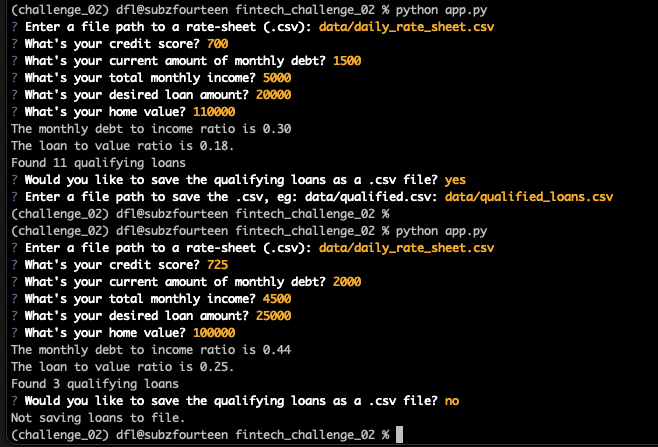

# Fintech Challenge 02 -- Loan Qualifier Application w/CLI

Command-line loan qualifier application, written in Python.

User will be prompted for a bank-rate sheet, and then input various credit information like: credit score, monthly debt, monthly income, desired loan amount and home value (see [usage](#usage) for details).

Optionally, user may save qualifying bank loans as a .csv file.

This challenge highlights modular program design and uses a text based CLI for interacting with the application.


---

## Technologies

This challenge uses python 3.7 and the following [built-in](https://docs.python.org/3/py-modindex.html) modules:
- [csv](https://docs.python.org/3/library/csv.html#module-csv)
- [pathlib](https://docs.python.org/3/library/pathlib.html#module-pathlib)

Additionally, it requires you to install the following modules with pip:
- [fire](https://github.com/google/python-fire)
- [questionary](https://github.com/tmbo/questionary)

See [installation guide](#installation-guide) below for specifics on setting up your environment.

---

## Installation Guide

You will need Python 3.7 for this application to run. An easy way to install python 3.7 is to download and install [Anaconda](https://www.anaconda.com/products/individual). After installing anaconda, open a terminal/command-prompt, and setup a python 3.7 environment, and then activate it like so:

```
# creating a python 3.7 environment
# name can be any friendly name to refer to your environment, eg 'dev'
conda create --name dev python=3.7 anaconda

# activating the environment
conda activate dev
```

Next, use [pip](https://pypi.org/project/pip/) to install the required [fire](https://github.com/google/python-fire) and [questionary](https://github.com/tmbo/questionary) modules:


```
# instaling required modules
$ pip install fire
$ pip install questionary
```
You are now ready to run the program!

---

## Usage

First, ensure you've cloned this repo and setup your environment as detailed in the [Installation Guide](#installation-guide)

Next, open a terminal in the same directory as the `app.py` file. This is the file you will run with python. The application will ask for inputs such as:
- file path to rate sheet # a csv with bank rates for today
- credit score
- current monthly debt
- total montlhy income
- desired loan amount
- home value

The application will then output your debt to income ratio, loan to value ratio, and whether any qualifying loans were found.

If qualifying loans were found, the user will be prompted to optionally save the resulting loans to a .csv file in the location of her choosing.

See below for CLI usage and some runtime examples with different inputs, and saving/not-saving the results.

```
# running the application
cd <path_to_repo>/fintech_challenge_02/
# launch the app and follow the prompts
python app.py
```




---

## Contributors

[David Lopez](https://github.com/sububer)

---

## License

MIT